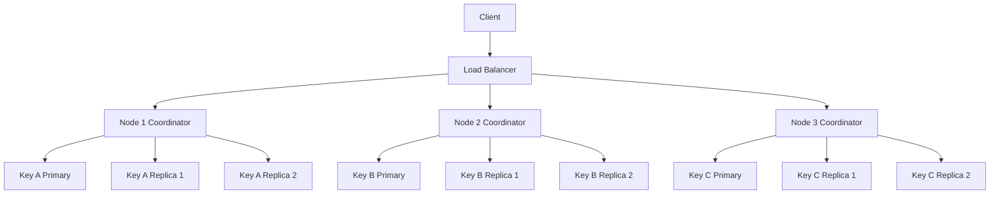
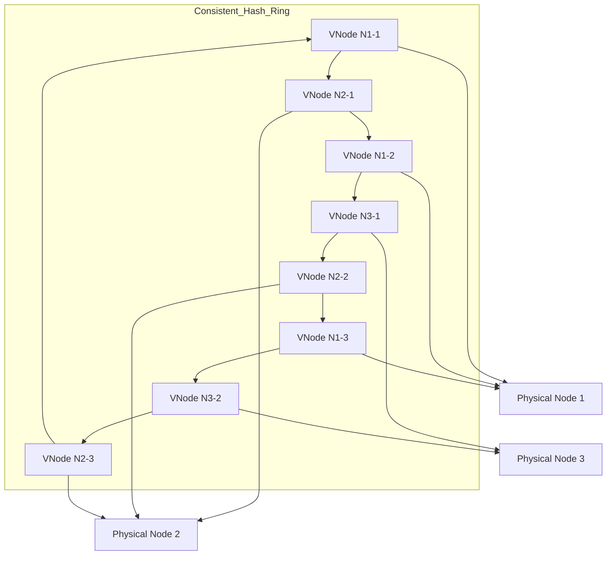
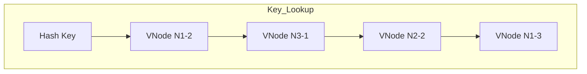
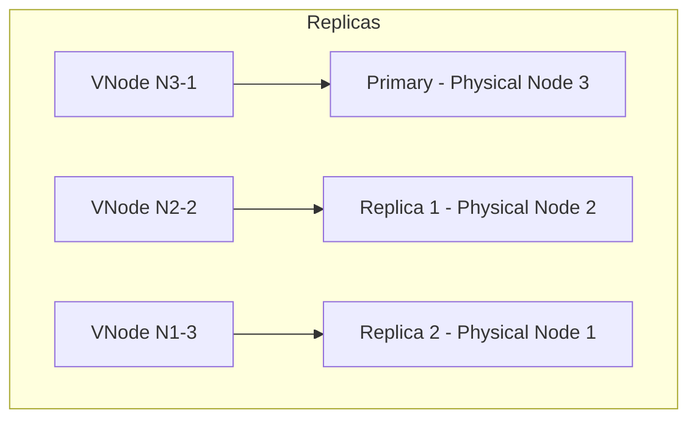
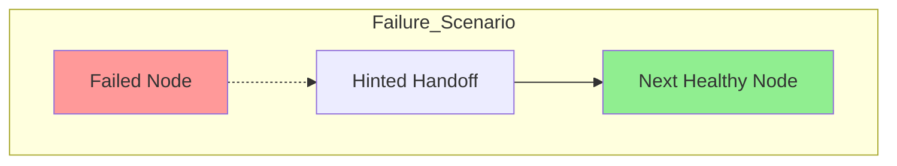

# Reliable Systems

## Learning Goals
- Learn how to keep a system running when nodes fail.  
- Understand trade offs between consistency and availability.

## Situation

Your system is horizontally scaled with nodes arranged in a **ring using consistent hashing**.  
Load is managed with horizontal scaling, consistent hashing and a network load balancer.  

**Problem:** Roughly once every three months, a server may fail, causing downtime for reads and writes.  
**Goal:** Design a system that remains fully available, allowing reads and writes even when a single node goes down.

---

## Deliverables

### System Design

Design a system that allows a node to temporarily go down while still giving read and write access to your data with zero downtime. Draw pictures and explain how it works.

### Considerations

To help focus your design, consider:
- How might you replicate data across multiple nodes?  
- How will clients continue to access data if a node fails?  
- What consistency and availability trade offs should you consider?  
- How might your design affect read/write latency under node failure?  
- How should the system handle nodes rejoining after a failure?  
- How does your design scale as the system grows in nodes or data volume?

## Reference Solution: Reliable Systems

### System Design

- **Topology**
  - **Consistent hashing ring** with virtual nodes to smooth key distribution.
  - **Replication factor N=3**: each key is stored on its primary and the next two successors on the ring.

- **Client routing**
  - Clients use a **stateless load balancer** to hit any healthy node.
  - Each node can act as a **coordinator**: computes a key’s replica set from ring membership and forwards to replicas.

- **Writes**
  - **Tunable consistency** with quorum: require W replicas to ack before success.
  - Choose defaults W=2, R=2 with N=3 so R+W>N for overlap.
  - If a replica is down, use **sloppy quorum**: write to next healthy nodes and store **hints** for original owners.
  - **Durability:** append to a commit log before ack; then apply to storage (e.g., LSM-tree/B-Tree).

- **Reads**
  - Coordinator queries R replicas.
  - Return the newest version via **timestamps** or **vector clocks**; apply **read repair** in background when replicas diverge.

- **Failure detection**
  - **Gossip protocol** for membership; phi-accrual/heartbeat for suspicion and timing.

- **Recovery**
  - On rejoin, peers deliver **hinted handoff** data.
  - Run **anti-entropy** synchronization (e.g., Merkle trees) to reconcile ranges.

- **Operations**
  - **Rebalancing:** consistent hashing + vnodes limit key movement when scaling.
  - **Backpressure:** protect nodes with queue limits and admission control.

### Diagrams

#### 1. System Architecture

#### 2. Consistent Hash Ring with Virtual Nodes

#### 3. Key Lookup Process

#### 4. Replica Assignment

#### 5. Failure Handling

### How Virtual Nodes Work

With virtual nodes, each physical node is mapped to multiple positions on the hash ring:

1. **Each physical node creates multiple vnodes** by hashing its identifier with different indices
2. **Vnodes are placed on the ring** at positions determined by their hash values
3. **Keys are assigned to the next vnode** in clockwise order from the key's hash position
4. **Replication follows the ring** - the next N vnodes after a key's primary vnode store its replicas

**Finding consecutive nodes with vnodes:**
- Hash the key to find its position on the ring
- Walk clockwise to find the next N vnodes
- Map each vnode back to its physical node
- If multiple vnodes belong to the same physical node, skip to the next unique physical node
- Continue until you have N distinct physical nodes

This approach ensures better load distribution and makes scaling more efficient since only a fraction of keys need to be remapped when nodes are added or removed.

### Considerations

- **Replication across nodes**
  - Replicate to N=3 consecutive nodes; use vnodes to avoid hot spots and ease rebalancing.

- **Access during node failure**
  - Coordinator writes to any W healthy replicas via sloppy quorum.
  - Reads succeed from any R healthy replicas; stale replicas get repaired.

- **Consistency vs availability**
  - Prefer availability with tunable consistency (AP); allow per-request overrides.
  - Pick R,W such that R+W>N for read-write overlap when needed.

- **Latency under failure**
  - Quorum waits and alternate replica routing can add tail latency.
  - Mitigate with hedged requests and sensible timeouts.

- **Node rejoin handling**
  - Hinted handoff delivers missed writes; anti-entropy ensures full reconciliation.
  - Gradually restore traffic to rejoined nodes.

- **Scalability**
  - Add nodes horizontally; only local ranges move due to consistent hashing.
  - Place replicas across racks/AZs to isolate failure domains.

### Recommended Actions

- **[replication]** Set N=3 with rack/AZ-aware placement.
- **[consistency]** Default R=2, W=2; support per-request overrides.
- **[availability]** Implement sloppy quorum and hinted handoff.
- **[repair]** Add read repair and periodic Merkle-tree anti-entropy.
- **[membership]** Use gossip and a phi-accrual failure detector.
- **[operability]** Track quorum latency, hint queues, and read-repair rate.
