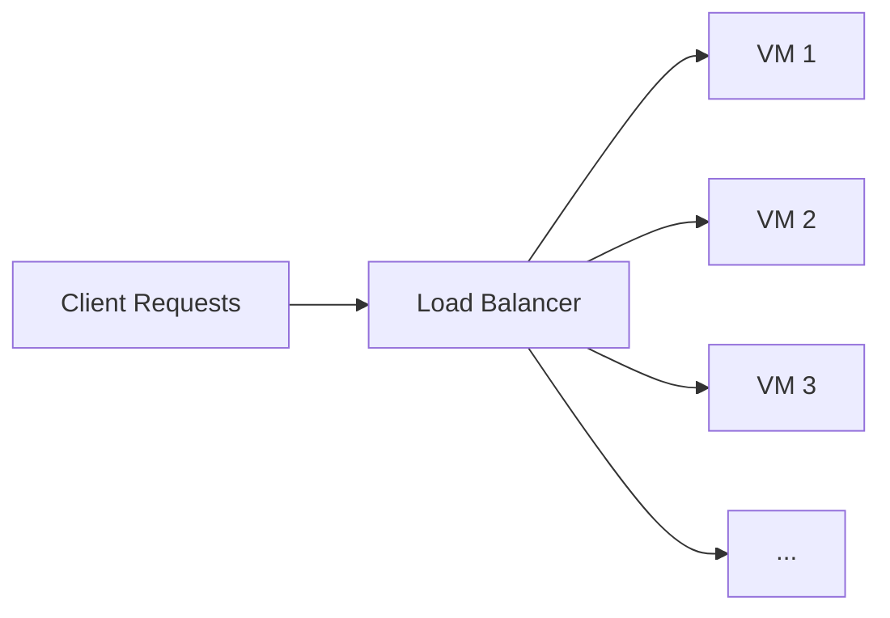

# Scaling

## Learning Goals
- Understand scaling up vs. scaling out  
- Learn how cloud costs affect system design

---

## Situation

You have a growing online book company using a **single server** that hosts an in-memory database:  

- **Memory:** 128 GB  
- **CPU:** 32 cores  
- **Capacity:** 200,000 requests per second (RPS)
- **Cost:** $1.25 per hour  

The system works most of the time, but as your customer base grows, you are seeing errors at peak load times because the single server cannot process requests fast enough.  

There are no available hardware options to scale up and this is the best and fastest server you can get.  

You are asked to design a scale-out solution using smaller 1-core cloud VMs:  

- **Memory:** 2 GB per VM  
- **Capacity:** 5,000 RPS per VM  
- **Cost:** $0.02 per hour per VM  

Your friend offers his network load balancer for free, which distributes requests randomly across your VMs. You can use it in your design.

---

## Deliverables

1. **System Design**  
   - Design a new system using the smaller VMs and load balancer. Draw a picture and explain how it works.  

2. **Cost Comparison**  
   - Compare hourly costs between the single server and your VM system.  

3. **Scaling Calculations**  
   - How many VMs would you need and how much would it cost to handle **200,000 RPS**?  
   - How many VMs would you need and how much would it cost to handle **10,000,000 RPS**?

## Answers

### 1. System Design

- **Load balancer** evenly/randomly distributes incoming requests across the pool.
- **Each VM** handles up to 5,000 RPS independently.
- **Scale out** by adding/removing VMs to meet target RPS.
- Keep app instances **stateless** so any VM can serve any request (externalize session/state if needed).

### 2. Cost Comparison

- **Single server (200k RPS capacity):** $1.25/hour
- **Small VM (5k RPS each):** $0.02/hour per VM
- **Cost per RPS-hour**
  - Single server: $1.25 / 200,000 ≈ $0.00000625
  - Small VM: $0.02 / 5,000 = $0.000004
- Result: Small VMs are cheaper per unit capacity and scale linearly.

### 3. Scaling Calculations

- **At 200,000 RPS**
  - VMs needed: ceil(200,000 / 5,000) = 40
  - Hourly cost: 40 × $0.02 = **$0.80/hour**
  - Versus single server: $1.25/hour → savings ≈ **$0.45/hour (~36%)**

- **At 10,000,000 RPS**
  - VMs needed: ceil(10,000,000 / 5,000) = 2,000
  - Hourly cost: 2,000 × $0.02 = **$40/hour**
