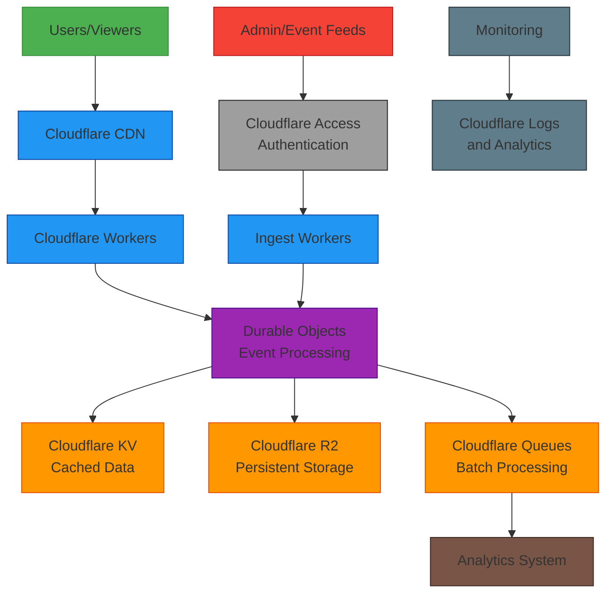

# System Design

## Learning Goals
- Design a system that handles high traffic with real-time updates.  
- Identify bottlenecks, scaling limits, and security boundaries.  
- Estimate costs for peak and moderate traffic.

---

## Situation

An investor asks you to take $1,000,000 (one million dollars) and deploy a website that hosts realtime stats for all events in the next Winter Olympics including leaderboards by different categories.  

Some quick research tells you you can expect about **360,000,000 requests per day** during **17 days** of the Olympic games.

---

## Deliverables

Use Cloudflare for everything.

1. **System Design**  
   - Draw a diagram showing all components and how requests flow.  
   - Explain how your system handles traffic and scales.

### How the System Works

#### 1. **User Request Flow**
- Users access the Olympic stats website through **Cloudflare CDN**, which serves cached content from the edge locations closest to them
- For dynamic content, requests are handled by **Cloudflare Workers** that run serverless functions at the edge
- Workers fetch data from **Cloudflare KV** (key-value store) for fast, globally-distributed reads

#### 2. **Real-time Data Processing**
- **Durable Objects** act as the core processing units, with each Olympic event having its own dedicated object
- These objects maintain state and ensure consistency for real-time updates
- When new data arrives (scores, times, etc.), Durable Objects:
  - Process and validate the update
  - Update the leaderboard calculations
  - Store the latest state in **Cloudflare KV** for fast reads
  - Archive data to **Cloudflare R2** (S3-compatible object storage) for persistence

#### 3. **Data Ingestion**
- **Admin/Event feeds** (trusted sources) send updates through a secure channel
- **Cloudflare Access** provides authentication for these administrative endpoints
- **Ingest Workers** validate and sanitize incoming data before passing it to Durable Objects

#### 4. **Scalability Features**
- **Automatic scaling**: Cloudflare automatically scales Workers and Durable Objects based on demand
- **Global distribution**: All components run at Cloudflare's edge locations worldwide
- **Batch processing**: Non-critical tasks are queued using **Cloudflare Queues** for asynchronous processing
- **Caching layers**: Multiple caching layers reduce load on processing components

#### 5. **Monitoring and Analytics**
- **Cloudflare Logs and Analytics** provide real-time monitoring of system performance
- Metrics are collected on request rates, cache hit ratios, and processing latencies
- An integrated **Analytics System** processes batched data for reporting and insights

This architecture handles the high traffic requirements (360M requests/day) by pushing computation to the edge and heavily leveraging caching. The system is designed to scale automatically with demand while maintaining low-latency responses for users worldwide.

2. **Bottlenecks & Scaling**  
   - Identify potential bottlenecks (e.g., real-time processing, database writes).  
   - Explain how your design addresses scaling constraints.

### Potential Bottlenecks

#### 1. **Durable Objects Serialization**
- **Bottleneck**: Each Durable Object processes updates sequentially, which could create a queue if updates arrive faster than they can be processed
- **Mitigation**: 
  - Limit the number of concurrent events per Object
  - Use multiple Durable Objects for high-traffic events
  - Implement efficient batching of updates within the Object

#### 2. **KV Write Capacity**
- **Bottleneck**: Cloudflare KV has rate limits on writes (approximately 1 write per second per key in the free tier, higher in paid tiers)
- **Mitigation**:
  - Batch updates to reduce write frequency
  - Use different keys for different granularities of data
  - Implement exponential backoff for rate limit handling

#### 3. **Network Bandwidth for Real-time Updates**
- **Bottleneck**: Broadcasting real-time updates to thousands of connected clients simultaneously
- **Mitigation**:
  - Use Cloudflare's global network to distribute the load
  - Implement client-side throttling to limit update frequency
  - Compress data payloads

#### 4. **Event Feed Ingestion**
- **Bottleneck**: Handling spikes in incoming data from event feeds
- **Mitigation**:
  - Queue incoming updates using Cloudflare Queues
  - Implement rate limiting at the ingest worker level
  - Use auto-scaling ingest workers

### Scaling Solutions

#### 1. **Horizontal Scaling**
- **Approach**: The system scales horizontally by adding more instances of components
- **Implementation**:
  - Cloudflare automatically adds more Worker instances based on demand
  - New Durable Objects are created for new events
  - Additional KV namespaces can be used for very large datasets

#### 2. **Geographic Distribution**
- **Approach**: All components run at Cloudflare's edge locations worldwide
- **Benefits**:
  - Reduced latency for users
  - Load distribution across multiple data centers
  - Improved fault tolerance

#### 3. **Caching Strategy**
- **Approach**: Multi-layer caching reduces load on processing components
- **Implementation**:
  - CDN caching for static and semi-static content
  - Worker response caching
  - Client-side caching with appropriate TTLs

#### 4. **Asynchronous Processing**
- **Approach**: Non-critical operations are processed asynchronously
- **Implementation**:
  - Analytics and reporting via Cloudflare Queues
  - Data archiving to R2 done asynchronously
  - Batch updates to reduce immediate processing load

#### 5. **Resource Allocation**
- **Approach**: Cloudflare's platform automatically allocates resources based on demand
- **Benefits**:
  - No manual intervention needed for scaling
  - Cost efficiency during low-traffic periods
  - Automatic handling of traffic spikes

3. **Security**  
   - Identify security boundaries (e.g., admin endpoints, APIs).  
   - Explain how security is maintained (encryption, authentication, firewalls).

### Security Boundaries

#### 1. **Admin Endpoints**
- **Boundary**: Ingest APIs for receiving real-time event data
- **Protection**: 
  - Isolated in private Worker routes not accessible from the public internet
  - Protected by Cloudflare Access for zero-trust authentication
  - Rate limited to prevent abuse
  - IP allowlisting for trusted event feed sources

#### 2. **Public APIs**
- **Boundary**: Read-only endpoints serving stats and leaderboard data
- **Protection**:
  - CORS restricted to official domains
  - Rate limited per IP to prevent scraping
  - Cached responses to reduce direct origin hits
  - Content Security Policy (CSP) headers

#### 3. **Internal Communication**
- **Boundary**: Communication between Workers, Durable Objects, KV, and Queues
- **Protection**:
  - All communication happens within Cloudflare's internal network
  - Service tokens for inter-service authentication
  - Encrypted at rest and in transit

#### 4. **Data Storage**
- **Boundary**: Cloudflare KV and R2 storage systems
- **Protection**:
  - Data encrypted at rest using Cloudflare's encryption
  - Access control through Worker bindings
  - Regular key rotation

### Security Measures

#### 1. **Encryption**
- **In Transit**: 
  - All communication uses HTTPS/TLS 1.3
  - API tokens and sensitive data encrypted in transit
- **At Rest**:
  - Cloudflare KV and R2 automatically encrypt data at rest
  - Secrets stored in encrypted environment variables

#### 2. **Authentication**
- **User Authentication**:
  - Cloudflare Access for admin interfaces
  - Signed URLs with time-limited tokens for premium content
- **Service Authentication**:
  - Service tokens for inter-Worker communication
  - Mutual TLS (mTLS) for critical service-to-service communication
  - HMAC signatures for event feed validation

#### 3. **Firewalls and DDoS Protection**
- **Cloudflare WAF**:
  - Pre-configured OWASP rules
  - Custom rules for Olympic-specific attack patterns
  - Real-time rule updates
- **DDoS Protection**:
  - Automatic DDoS mitigation at Cloudflare's edge
  - Rate limiting rules for API endpoints
  - Geo-blocking if necessary

#### 4. **Monitoring and Auditing**
- **Logging**:
  - All access logs sent to Cloudflare Logs
  - Security events flagged and alerted
  - Audit trails for admin actions
- **Monitoring**:
  - Real-time anomaly detection
  - Automated alerts for suspicious activity
  - Regular security scanning

#### 5. **Incident Response**
- **Preparation**:
  - Pre-defined incident response procedures
  - Backup and rollback mechanisms
  - Regular security assessments
- **Response**:
  - Automated blocking of malicious IPs
  - Emergency key rotation procedures
  - Communication plan for stakeholders

4. **Cost Estimation**  
   - Calculate costs for peak load (17 days) and half load (17 days).  
   - Include a table of technologies you'll use and associated costs, showing your calculations.

### Assumptions
- **Traffic**: Peak 360M requests/day; Half 180M requests/day; both for 17 days.
- **Cache hit**: 99.9% of reads served from CDN cache without Worker execution.
- **Worker/Durable Object on cache miss**: 0.1% of reads invoke Workers and 1 Durable Object op.
- **Ingest writes**: Peak period 20 updates/sec for 12h/day; Half period 10 updates/sec for 12h/day.
- **Payload sizes**: Read response 20 KB avg; write event 2 KB archived to R2.
- **KV writes**: 0.5 KV write per ingest update on average (coalesced snapshots).
- **Queues**: 1 enqueue + 1 dequeue per ingest update.
- **Pricing (public list, rounded)**: Workers $0.30/million req; Durable Objects $0.15/million req; KV reads $0.50/million; KV writes $5.00/million; Queues $0.40/million ops; R2 storage $0.015/GB-month. CDN egress is typically covered under Enterprise; usage-priced egress not included here.

### Volumes
- **Reads (Peak)**: 360,000,000/day × 17 = 6.12B total reads; 0.1% misses → 6.12M Worker+Durable Object ops.
- **Reads (Half)**: 180,000,000/day × 17 = 3.06B total reads; 0.1% misses → 3.06M Worker+Durable Object ops.
- **Writes (Peak)**: 20/sec × 43,200 sec/day × 17 = 14.688M updates.
- **Writes (Half)**: 10/sec × 43,200 sec/day × 17 = 7.344M updates.
- **KV Reads**: equal to read misses.
- **KV Writes (Peak/Half)**: 0.5 × updates → 7.344M / 3.672M.
- **Queues Ops (Peak/Half)**: 2 × updates → 29.376M / 14.688M.
- **R2 Data Added (Peak/Half)**: updates × 2 KB → ~28.7 GB / ~14.3 GB.

### Calculations (Usage-Based)
- **Workers requests**: (misses + writes)
  - Peak: 6.12M + 14.688M = 20.808M → 20.808 × $0.30 = $6.24
  - Half: 3.06M + 7.344M = 10.404M → 10.404 × $0.30 = $3.12
- **Durable Objects requests**: ~writes count
  - Peak: 14.688M → 14.688 × $0.15 = $2.20
  - Half: 7.344M → 7.344 × $0.15 = $1.10
- **KV reads**:
  - Peak: 6.12M → 6.12 × $0.50 = $3.06
  - Half: 3.06M → 3.06 × $0.50 = $1.53
- **KV writes**:
  - Peak: 7.344M → 7.344 × $5.00 = $36.72
  - Half: 3.672M → 3.672 × $5.00 = $18.36
- **Queues ops**:
  - Peak: 29.376M → 29.376 × $0.40 = $11.75
  - Half: 14.688M → 14.688 × $0.40 = $5.88
- **R2 storage (1 month)**:
  - Peak: ~30 GB × $0.015 = $0.45
  - Half: ~15 GB × $0.015 = $0.23

### Usage-Based Cost Table (17 days)

| Service | Unit Price | Peak Quantity | Peak Cost | Half Quantity | Half Cost |
|---|---:|---:|---:|---:|---:|
| Workers requests | $0.30 / 1M | 20.808M | $6.24 | 10.404M | $3.12 |
| Durable Objects req | $0.15 / 1M | 14.688M | $2.20 | 7.344M | $1.10 |
| KV reads | $0.50 / 1M | 6.12M | $3.06 | 3.06M | $1.53 |
| KV writes | $5.00 / 1M | 7.344M | $36.72 | 3.672M | $18.36 |
| Queues ops | $0.40 / 1M | 29.376M | $11.75 | 14.688M | $5.88 |
| R2 storage | $0.015 / GB-mo | 30 GB | $0.45 | 15 GB | $0.23 |
| CDN egress | Included in Enterprise | 122 TB | — | 61 TB | — |
| TOTAL (usage fees only) |  |  | **$60.42** |  | **$30.22** |

### Enterprise Plan Consideration
- Production traffic at Olympic scale typically requires a Cloudflare Enterprise contract (WAF, Bot Management, SLA, Logpush, priority support, custom limits).
- For budgeting, assume an Enterprise engagement for the Olympic window at a flat fee. Example placeholder: **$200,000** for 1–2 months. This is an assumption and must be vendor-quoted.

### Summary
- **Usage-based fees are minimal** relative to traffic due to high cache hit rates and per-million pricing (tens of dollars for the compute/storage pieces).
- **Primary cost driver is the Enterprise contract**, which provides the necessary protections and support at this scale.
- With a $1,000,000 budget, this design leaves ample headroom for operations, monitoring, contingency, and team costs during the event window.
